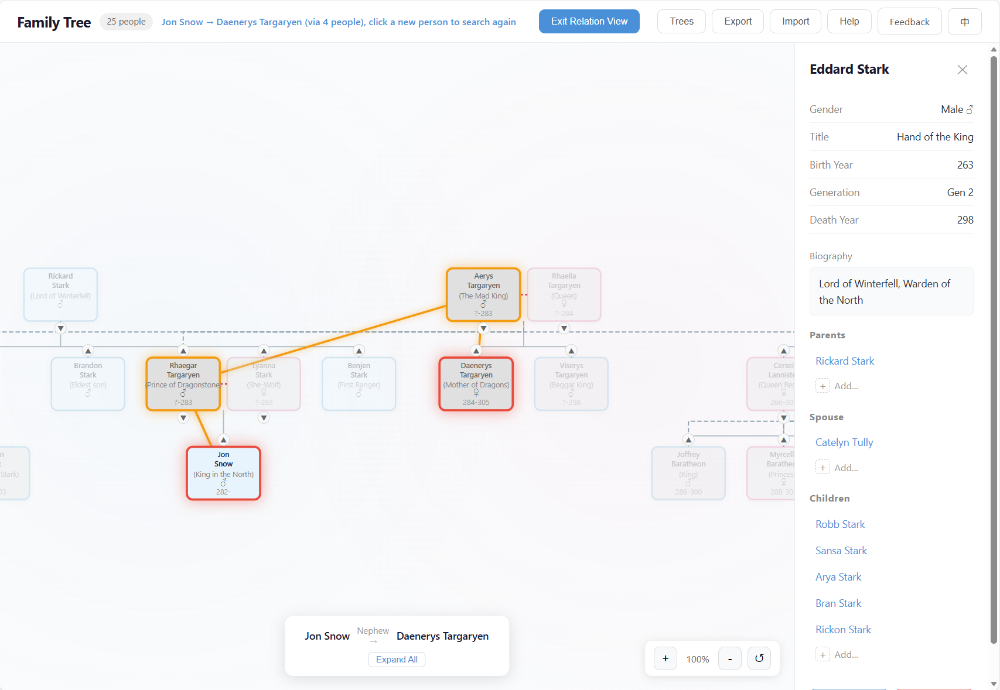
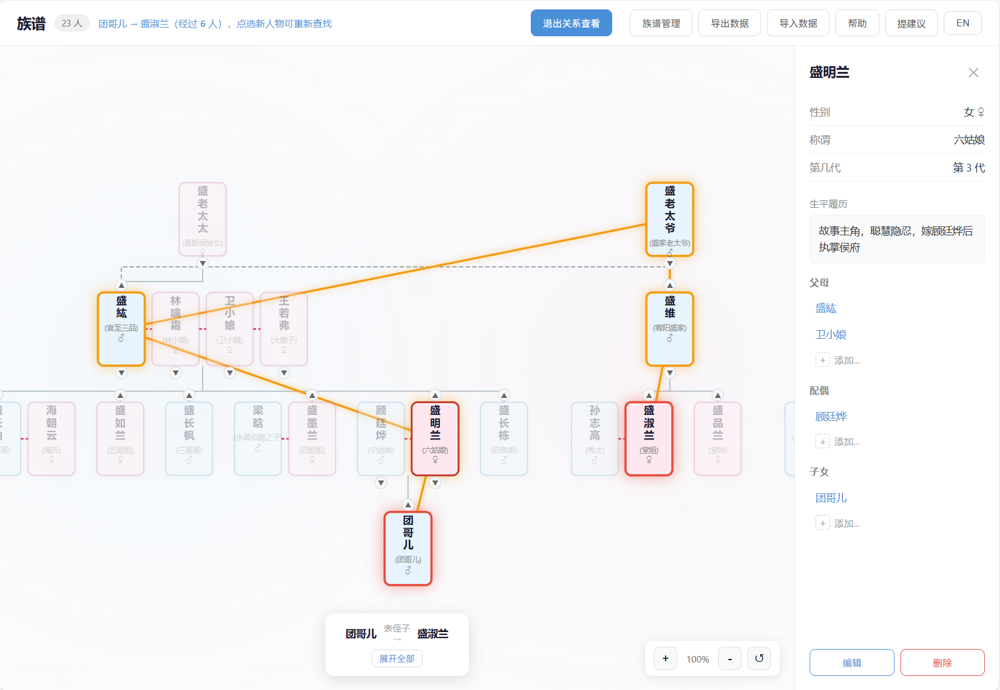

# 族谱编辑器 / Family Tree Editor

**[English](#features) · [中文文档](#中文)**



A visual, interactive family tree editor that runs entirely in your browser. All data stays on your device — nothing is ever sent to a server.

## Features

### Visual Tree Canvas

- Hierarchical tree layout with automatic positioning
- Smooth pan, zoom (mouse wheel & pinch), and drag interactions
- Drag-and-drop to reorder siblings or adjust generations
- Color-coded person cards (blue for male, pink for female) showing name, title, birth/death years

### Person Management

- Add, edit, and delete family members with detailed biographical info (name, gender, title, birth/death year, biography)
- Manage parent, spouse, and child relationships through an intuitive sidebar
- Click any card to inspect full details and navigate relationships

### Relationship Discovery

- Select any two people to automatically discover and display the relationship chain between them
- Highlights the connection path across generations (e.g. grandfather → father → son)

### Batch Selection & Operations

- Enter selection mode to pick multiple people by clicking or rubber-band dragging
- Batch delete selected people
- Move selected people under a new parent node (reassigns parent-child relationships)
- Visual checkboxes and blue highlight for selected cards

### Tree Management

- Manage multiple family trees with named tree roots
- Load built-in sample datasets (Han Dynasty Imperial Family, Youyang Sheng Clan) to explore the editor instantly
- Search across all people by name
- Create new trees by specifying a core person and tree name

### Data Import & Export

- Export your entire family tree as a JSON file for backup or sharing
- Import JSON files to restore data (replaces all current data and resets the tree filter view)
- All data persisted in browser `localStorage` — survives page refreshes and browser restarts

### Privacy First

- **100% client-side** — zero network requests for your data
- No accounts, no tracking, no analytics
- Your family data never leaves your browser

## Quick Start

```bash
# Clone the repository
git clone https://github.com/Wenzhi-Ding/zupu.git
cd zupu

# Install dependencies
npm install

# Start the development server
npm run dev
```

Open [http://localhost:5173](http://localhost:5173) in your browser. Click **族谱管理** (Tree Manager) to load a sample dataset and start exploring.

## Tech Stack

| Layer | Technology |
|-------|-----------|
| UI Framework | React 19 |
| Language | TypeScript 5.9 |
| State Management | Zustand 5 |
| Build Tool | Vite 7 |
| Layout Engine | Custom SVG-based tree layout |
| Persistence | Browser localStorage |

## Project Structure

```
src/
├── components/        # React UI components
│   ├── FamilyTree     # Main SVG canvas with pan/zoom/drag/rubber-band selection
│   ├── PersonCard     # Individual person node in the tree (with selection checkbox)
│   ├── Sidebar        # Person detail panel & relation editing
│   ├── TreeManager    # Multi-tree management dialog
│   ├── RelationshipChain  # Relationship path display
│   ├── AddPersonDialog    # New person creation form
│   ├── DataManager    # JSON import/export controls
│   ├── HelpGuide      # Built-in help documentation
│   └── ...
├── store/             # Zustand state management
│   ├── familyStore    # Core application state & actions
│   └── localDb        # localStorage persistence layer
├── layout/            # Tree layout algorithm (BFS-based positioning)
├── data/              # Built-in sample datasets
├── types/             # TypeScript type definitions
└── utils/             # Relationship chain pathfinding (BFS)
```

## Build & Deploy

```bash
# Production build
npm run build

# Preview the build locally
npm run preview
```

The build output (`dist/`) is a fully static site. Deploy it anywhere:

- **Vercel** — connect your repo; zero config needed (`vercel.json` included for SPA routing)
- **Cloudflare Pages** — set build command to `npm run build`, output directory to `dist`
- **GitHub Pages / Nginx / any static host** — just serve the `dist/` folder

## Data & Privacy

All data is stored in your browser's `localStorage`. It is never transmitted over the network. We recommend periodically exporting your data as JSON (**导出数据** button) to guard against browser data loss.

---

## 中文

**[English](#features) · [中文文档](#中文)**



一个可视化、交互式的族谱编辑器，完全在浏览器中运行。所有数据都保存在你的设备上，不会发送到任何服务器。

### 功能特性

#### 可视化树形画布

- 自动定位的层级树形布局
- 流畅的平移、缩放（鼠标滚轮和捏合）和拖拽交互
- 拖放调整兄弟姐妹的顺序或调整世代位置
- 颜色编码的人物卡片（蓝色为男性，粉色为女性），显示姓名、头衔、出生/去世年份

#### 人物管理

- 添加、编辑和删除家族成员，支持详细的个人资料（姓名、性别、头衔、出生/去世年份、简介）
- 通过直观的侧边栏管理父母、配偶和子女关系
- 点击任意卡片查看完整详情并导航关系

#### 关系发现

- 选择任意两个人，自动发现并展示他们之间的关系链
- 高亮跨代的连接路径（例如：祖父 → 父亲 → 儿子）

#### 批量选择与操作

- 进入选择模式，通过点击或框选选取多个人物
- 批量删除选中人物
- 将选中人物移动到新的父节点下（重新分配父子关系）
- 可视化复选框和蓝色高亮显示选中卡片

#### 族谱管理

- 管理多个族谱，支持命名的树根
- 加载内置示例数据集（汉朝皇室、酉阳胜氏）即刻体验
- 按姓名搜索所有人物
- 通过指定核心人物和族谱名称创建新族谱

#### 数据导入与导出

- 将整个族谱导出为 JSON 文件用于备份或分享
- 导入 JSON 文件恢复数据（替换当前所有数据并重置树形筛选视图）
- 所有数据持久化存储在浏览器 `localStorage` 中，刷新页面和重启浏览器后依然保留

#### 隐私优先

- **100% 客户端运行** — 你的数据零网络请求
- 无账号、无追踪、无分析
- 你的家族数据永远不会离开你的浏览器

### 快速开始

```bash
# 克隆仓库
git clone https://github.com/Wenzhi-Ding/zupu.git
cd zupu

# 安装依赖
npm install

# 启动开发服务器
npm run dev
```

在浏览器中打开 [http://localhost:5173](http://localhost:5173)。点击 **族谱管理** 加载示例数据集，即刻开始探索。

### 技术栈

| 层级 | 技术 |
|------|------|
| UI 框架 | React 19 |
| 编程语言 | TypeScript 5.9 |
| 状态管理 | Zustand 5 |
| 构建工具 | Vite 7 |
| 布局引擎 | 自定义基于 SVG 的树形布局 |
| 数据持久化 | 浏览器 localStorage |

### 构建与部署

```bash
# 生产构建
npm run build

# 本地预览构建结果
npm run preview
```

构建输出（`dist/`）是一个完全静态的站点，可以部署到任何地方：

- **Vercel** — 连接你的仓库，零配置（已包含 `vercel.json` 用于 SPA 路由）
- **Cloudflare Pages** — 构建命令设为 `npm run build`，输出目录设为 `dist`
- **GitHub Pages / Nginx / 任意静态托管** — 直接提供 `dist/` 文件夹

### 数据与隐私

所有数据存储在浏览器的 `localStorage` 中，不会通过网络传输。建议定期将数据导出为 JSON（**导出数据** 按钮），以防浏览器数据丢失。

## License

[MIT](LICENSE)
