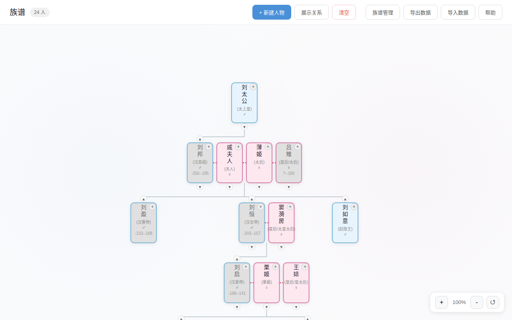
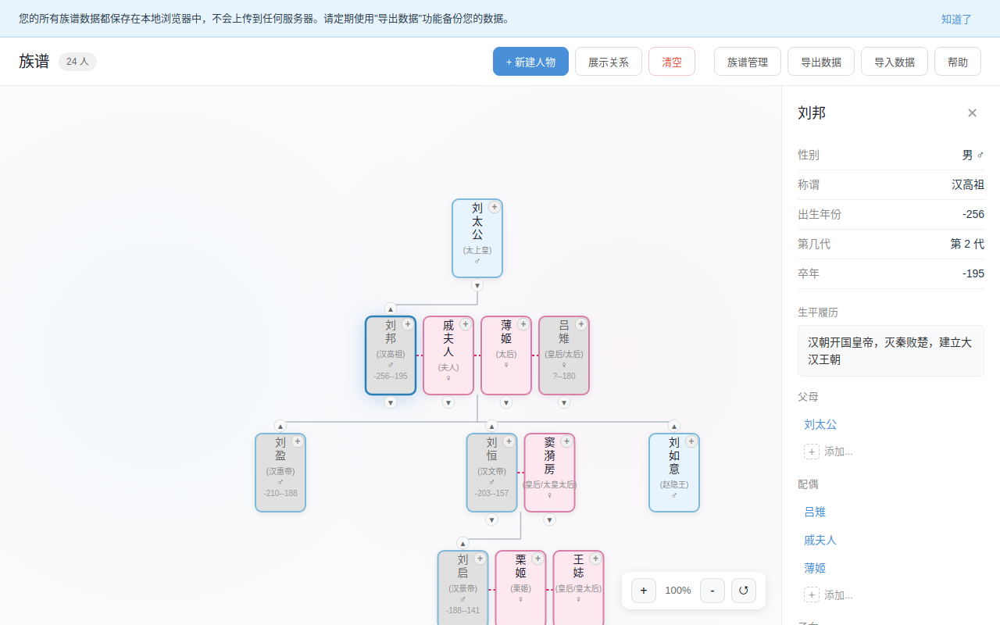
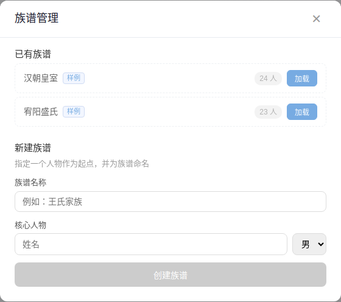

# 族谱编辑器 / Family Tree Editor

A visual, interactive family tree editor that runs entirely in your browser. All data stays on your device — nothing is ever sent to a server.



## Features

### Visual Tree Canvas

- Hierarchical tree layout with automatic positioning
- Smooth pan, zoom (mouse wheel & pinch), and drag interactions
- Drag-and-drop to reorder siblings or adjust generations
- Color-coded person cards (blue for male, pink for female) showing name, title, birth/death years

### Person Management

- Add, edit, and delete family members with detailed biographical info (name, gender, title, birth/death year, biography)
- Manage parent, spouse, and child relationships through an intuitive sidebar
- Click any card to inspect full details and navigate relationships



### Relationship Discovery

- Select any two people to automatically discover and display the relationship chain between them
- Highlights the connection path across generations (e.g. grandfather → father → son)

### Batch Selection & Operations

- Enter selection mode to pick multiple people by clicking or rubber-band dragging
- Batch delete selected people
- Move selected people under a new parent node (reassigns parent-child relationships)
- Visual checkboxes and blue highlight for selected cards

### Tree Management

- Manage multiple family trees with named tree roots
- Load built-in sample datasets (Han Dynasty Imperial Family, Youyang Sheng Clan) to explore the editor instantly
- Search across all people by name
- Create new trees by specifying a core person and tree name



### Data Import & Export

- Export your entire family tree as a JSON file for backup or sharing
- Import JSON files to restore data (replaces all current data and resets the tree filter view)
- All data persisted in browser `localStorage` — survives page refreshes and browser restarts

### Privacy First

- **100% client-side** — zero network requests for your data
- No accounts, no tracking, no analytics
- Your family data never leaves your browser

## Quick Start

```bash
# Clone the repository
git clone https://github.com/your-username/genealogy-public.git
cd genealogy-public

# Install dependencies
npm install

# Start the development server
npm run dev
```

Open [http://localhost:5173](http://localhost:5173) in your browser. Click **族谱管理** (Tree Manager) to load a sample dataset and start exploring.

## Tech Stack

| Layer | Technology |
|-------|-----------|
| UI Framework | React 19 |
| Language | TypeScript 5.9 |
| State Management | Zustand 5 |
| Build Tool | Vite 7 |
| Layout Engine | Custom SVG-based tree layout |
| Persistence | Browser localStorage |

## Project Structure

```
src/
├── components/        # React UI components
│   ├── FamilyTree     # Main SVG canvas with pan/zoom/drag/rubber-band selection
│   ├── PersonCard     # Individual person node in the tree (with selection checkbox)
│   ├── Sidebar        # Person detail panel & relation editing
│   ├── TreeManager    # Multi-tree management dialog
│   ├── RelationshipChain  # Relationship path display
│   ├── AddPersonDialog    # New person creation form
│   ├── DataManager    # JSON import/export controls
│   ├── HelpGuide      # Built-in help documentation
│   └── ...
├── store/             # Zustand state management
│   ├── familyStore    # Core application state & actions
│   └── localDb        # localStorage persistence layer
├── layout/            # Tree layout algorithm (BFS-based positioning)
├── data/              # Built-in sample datasets
├── types/             # TypeScript type definitions
└── utils/             # Relationship chain pathfinding (BFS)
```

## Build & Deploy

```bash
# Production build
npm run build

# Preview the build locally
npm run preview
```

The build output (`dist/`) is a fully static site. Deploy it anywhere:

- **Vercel** — connect your repo; zero config needed (`vercel.json` included for SPA routing)
- **Cloudflare Pages** — set build command to `npm run build`, output directory to `dist`
- **GitHub Pages / Nginx / any static host** — just serve the `dist/` folder

## Data & Privacy

All data is stored in your browser's `localStorage`. It is never transmitted over the network. We recommend periodically exporting your data as JSON (`导出数据` button) to guard against browser data loss.

## License

[MIT](LICENSE)
